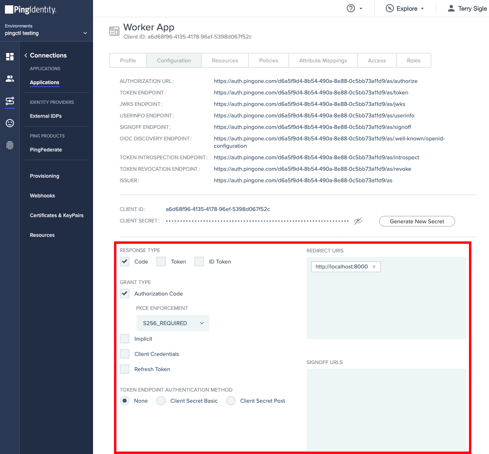
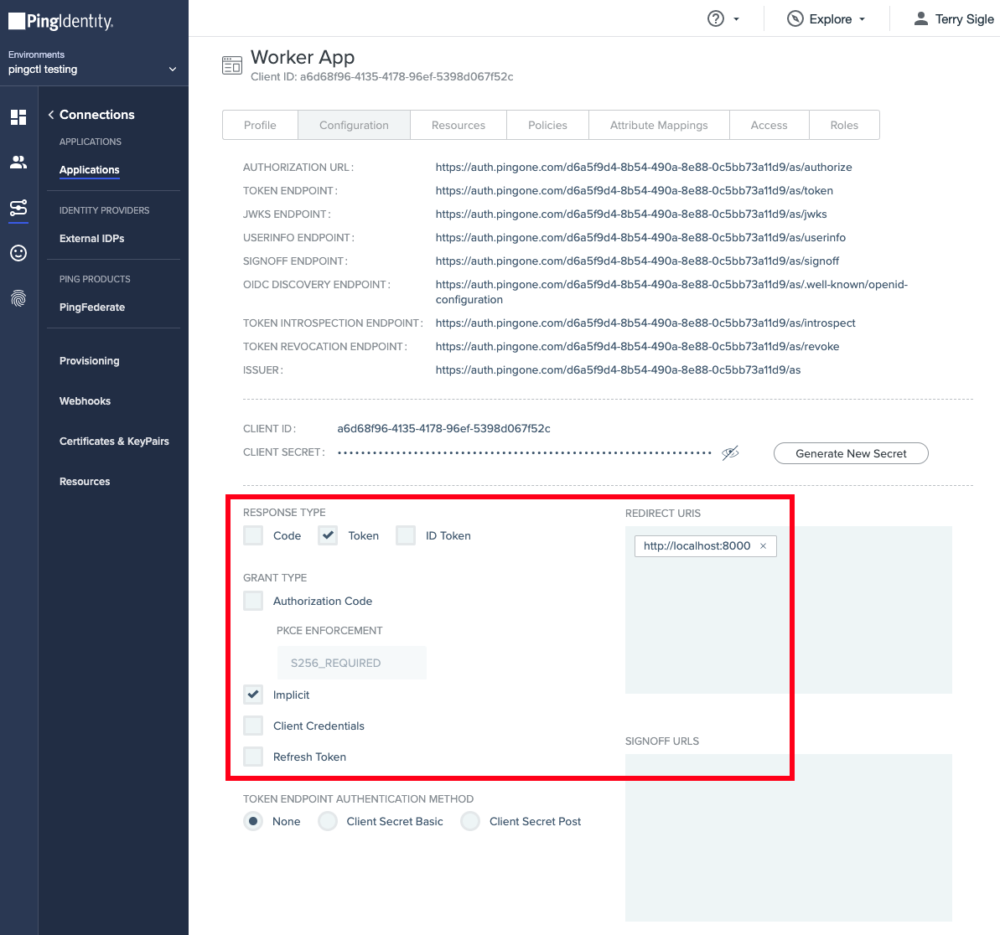
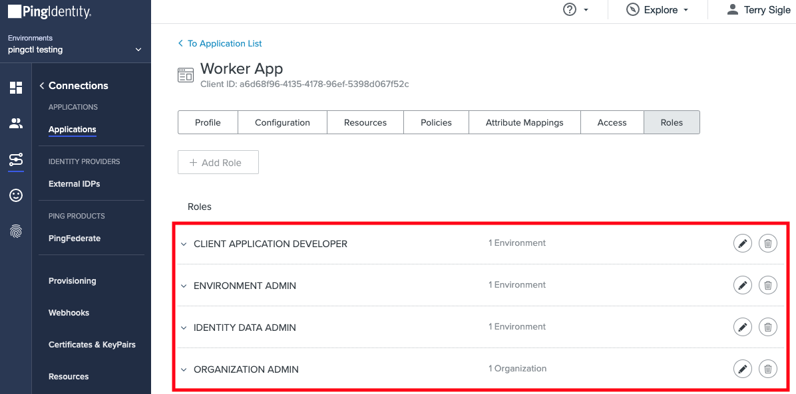
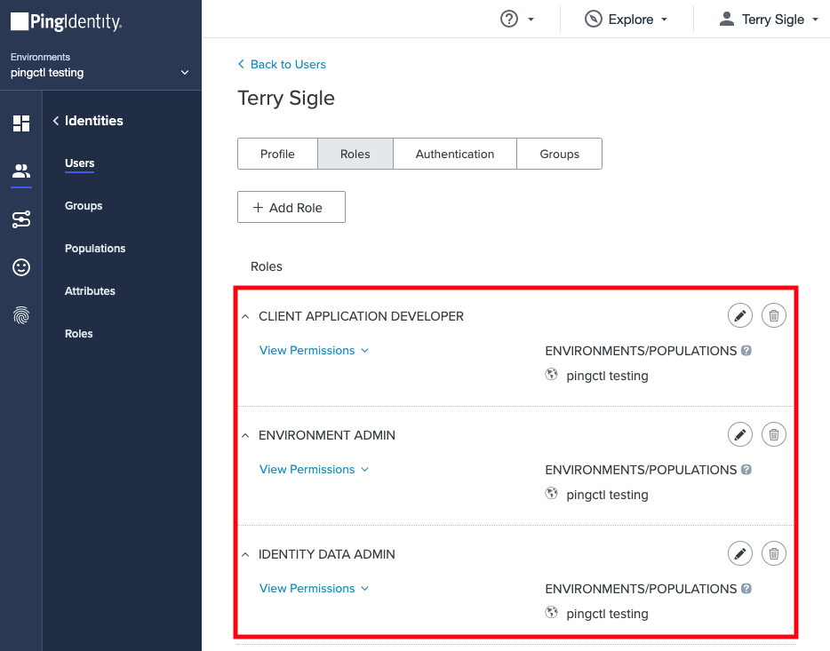

# PingOne Worker App and User Config

## PingOne Worker App Configuration

In order to manage PingOne resources other than yourself, you are required to have a PingOne Worker App.

You have 3 options to authenticate to PingOne from pingctl:

* [Authorization Code (w/ PKCE) Flow](#authorization-code-w-pkce-flow-settings) (Recommended and most secure) - Via a PingOne Admin User
* [Implicit Flow](#implicit-flow-settings) - Via a PingOne Admin User
* [Client Credentials Flow](#client-credentials-flow-settings) (Easiest, but most insecure, as a user isn't required)

Additionally, you must setup the proper [roles for your Worker App](#worker-app-roles-settings)

### Authorization Code (w/ PKCE) Flow Settings

The following shows an example of a Worker App setup for Authorization Code (w/ PKCE) Flow:

### Implicit Flow Settings

The following shows an example of a Worker App setup for Implicit Flow:

### Client Credentials Flow Settings

The following shows an example of a Worker App setup for Client Credentials Flow:

### Worker App Roles Settings

The following shows an example of the minimum roles required.  Typically, these are setup by default.

## PingOne User Config

When using Authorization Code or Implicit Flows, you need to login with an Administrative user to use the
Worker App.

The most important item is to add the proper administrative roles to the user.  The following shows
an example of this:

